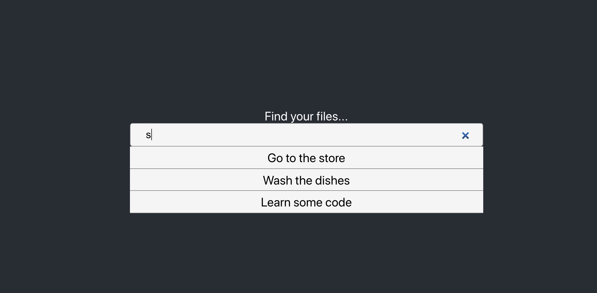

# Rethink - Search Filter and URL Shortner

## To clone Repo:
> $ git clone --recursive https://github.com/vcermeno/rethink.git

## Table of Contents:
* [Search Filter](#search-filter)
* [URL Shortener](#url-shortener)

## Search filter

 ### Setup
 > $ cd ./search_box  
 > $ yarn install  
 > $ yarn start  

 ## How to Use:
 1. Go to localhost:3000
 2. Enter letters and search

 ### Limitations and Assumptions
   - The filter is currently accepting dummy data that takes the form([,,,])
   - React can only render about a hundred elements at a time so filter is used to limit the amount. Ideally, I would be able to make a request with the letters I'm searching for.
     - Due to the size of the page, I only show the top 4 results
## Url Shortener
 ### Setup
 > $ cd ./url_shortener  
 > $ npm install  
 > $ npm start  

 In another terminal:
 > $ redis-server

 1. Go to localhost:3000
 2. Make a POST request to (localhost:3000/url) and send your url in the request body (i.e. { "url": "http://google.com" })
 3. Save your recieved shortUrl (i.e. localhost:3000/url/MZi2PMVhf)
 4. Use your short url in the browser and be redirected to your site.
 ### Limitations and Assumptions
  - I assumed a small number of items placed in the database, so I used Redis for an in-memory database
  - I also did not hash anything I stored in the database. Urls aren't sensitive information and did not prioritize it
  - I also did not provide any url validation so if the url is wrong, an error will be sent to the user but the shortened url will not be given since it will not redirect the user (urls must be given with "http://")
  - If more than one person tries to get a shortened url for the same site, they will recieve completely different urls. This is not ideal for scaling since caching would become less efficient.
